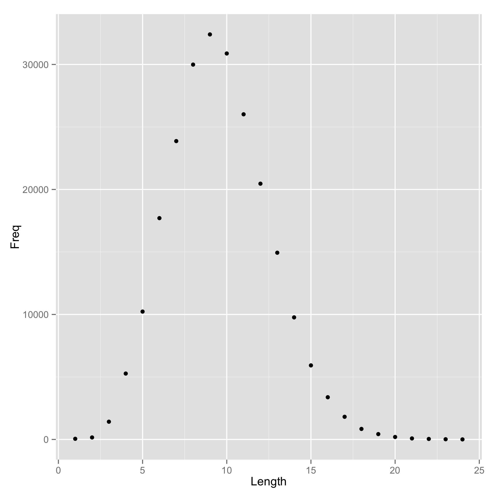

# Histogram of English Word Lengths
Wesley Gerelle  
2014-11-18  




```r
data <- read.delim("histogram.tsv")
```


```r
most.common.length <- data$Length[which.max(data$Freq)]
```

The most common English word length is 9.
